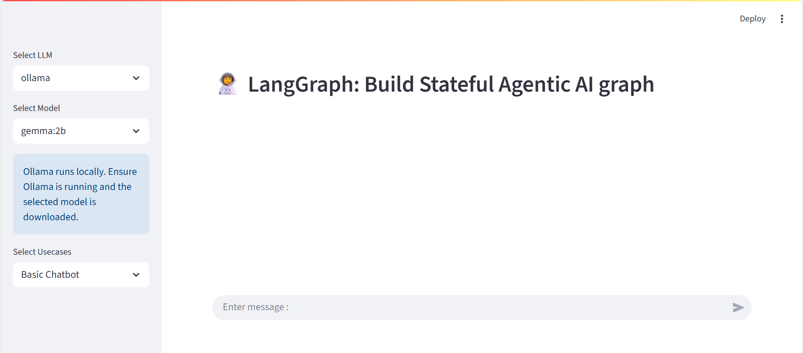
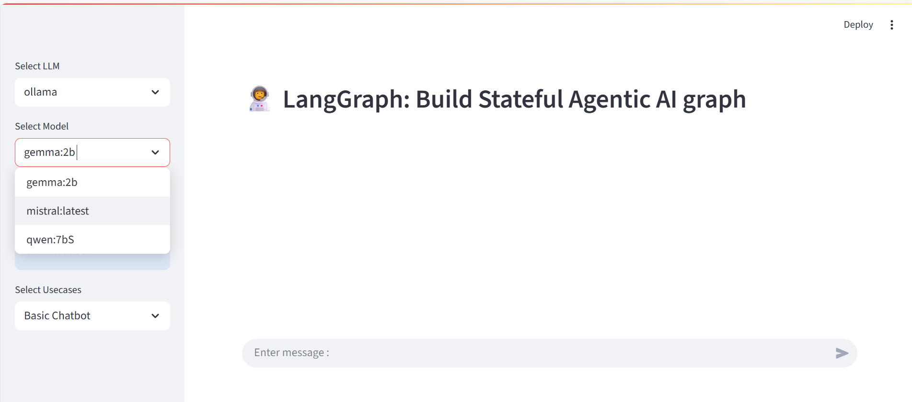
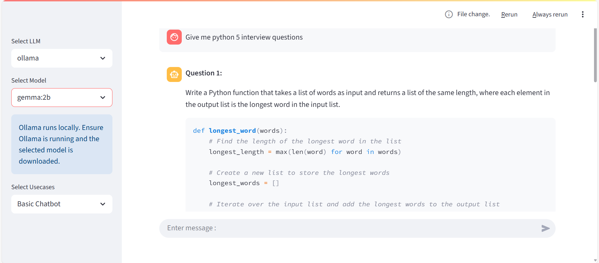
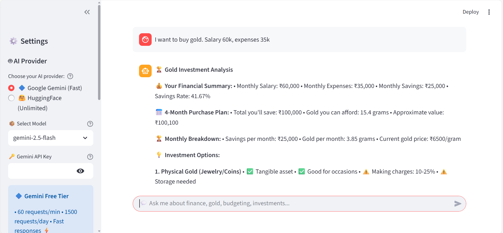
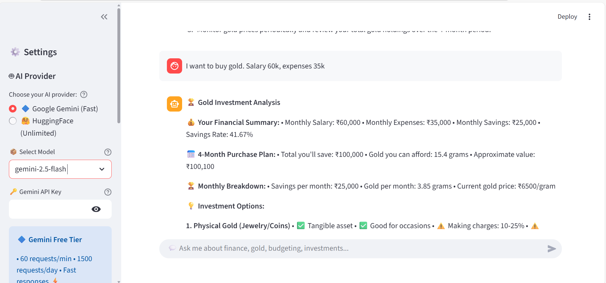

# 💰 AI Financial Advisor Chatbot

An intelligent financial advisory chatbot powered by **LangGraph** with dual LLM support (**Google Gemini** & **HuggingFace**).

[](https://www.python.org/)
[](https://streamlit.io/)
[](https://github.com/langchain-ai/langgraph)
[](https://opensource.org/licenses/MIT)

---

## 📦 Table of Contents

- [Features](#features)
- [Screenshots](#screenshots)
- [Installation](#installation)
- [API Keys Setup](#api-keys-setup)
- [Usage](#usage)
- [Example Queries](#example-queries)
- [Configuration](#configuration)
- [Project Structure](#project-structure)
- [Tech Stack](#tech-stack)
- [Troubleshooting](#troubleshooting)
- [Known Limitations](#known-limitations)
- [License](#license)
- [Contact](#contact)

---

## 🚀 Features

### **Specialized Financial Services:**
- 🏆 **Gold Investment Planning** - Calculate affordable gold purchases based on your income and expenses
- 💰 **Budget Analysis** - Analyze your monthly budget using the 50-30-20 rule
- 📊 **Investment Advice** - Get personalized investment recommendations
- 📈 **Financial Health Assessment** - Track your savings rate and financial goals
- 🤖 **General Financial Q&A** - Ask any finance-related questions

### **Technical Features:**
- 🔷 **Dual LLM Support** - Choose between Google Gemini (fast) or HuggingFace (unlimited)
- ⚡ **Dynamic Responses** - AI-generated, context-aware advice (not templates)
- 📋 **Structured Outputs** - Point-wise, easy-to-read financial analysis
- 🔄 **Intelligent Routing** - Automatically routes queries to specialized agents
- 💾 **Session Persistence** - Maintains conversation history
- 🌐 **100% Free** - No credit card required for either LLM provider

---
---

## ⚠️ Disclaimer

**IMPORTANT:** This chatbot provides general financial information for **educational purposes only**. 

- ❌ **NOT** a substitute for professional financial advice
- ❌ **NOT** certified financial planning
- ❌ **NOT** responsible for financial decisions made based on this tool

**Always consult certified financial advisors before making important financial decisions.**

---

## 📷 Screenshots

### Home Page


### AI Provider Selection


### Chatbot Functionality


### Gold Investment Analysis


### Budget Analysis


---

## 📥 Installation

### **Prerequisites**
- Python 3.10 or higher
- pip package manager
- Internet connection (for cloud LLMs)

### **Step-by-Step Setup:**

```bash
# 1. Clone the repository
git clone https://github.com/ShashankGowni/Agentic_ChatBot.git
cd Agentic_ChatBot

# 2. Create virtual environment
python -m venv venv

# 3. Activate virtual environment
# Windows:
venv\Scripts\activate
# Mac/Linux:
source venv/bin/activate

# 4. Install dependencies
pip install -r requirements.txt

```
### 🔑 API Keys Setup
You need at least ONE of these API keys (both are 100% FREE):

- Option 1: Google Gemini (Recommended - Faster ⚡)
- Go to Google AI Studio
- Sign in with your Google account
- Click "Create API Key"
- Click "Create API key in new project"
- Copy the key (starts with AIzaSy...)

**Free Tier:**

- ✅ 60 requests per minute
- ✅ 1,500 requests per day
- ✅ No credit card required

### Option 2: HuggingFace (Unlimited Requests 🚀)

### Go to HuggingFace
- Sign up (completely free, no credit card)
- Go to Settings → Access Tokens
- Click "New token"
- Select "Read" access
- Copy the token (starts with hf_...)

**Free Tier:**

- ✅ Unlimited requests
- ✅ No credit card required

## Set Up Your Keys:
Create a .env file in the project root directory (same level as app.py):

## env

# Google Gemini API Key (get from: https://aistudio.google.com/app/apikey)
```env 
GEMINI_API_KEY=your_gemini_api_key_here
```

# HuggingFace API Token (get from: https://huggingface.co/settings/tokens)
```env 
HUGGINGFACE_API_TOKEN=your_huggingface_token_here
```

## ⚠️ Important:

- Never commit the .env file to GitHub (it's already in .gitignore)
- You can use either or both keys

### 💡 Usage
Run the Application:
```bash
streamlit run app.py
```

### In Your Browser:
- Open: http://localhost:8501
- Select AI Provider: Choose between 🔷 Gemini (fast) or 🤗 HuggingFace (unlimited)
- Select Model: Pick from available models in the dropdown
- Enter API Key: Paste your key in the sidebar (or it auto-loads from .env)
- Choose Use Case:
- Financial Advisor
- Gold Investment Advisor
- Budget Analyzer
- Basic Chatbot
- Start Chatting! 💬

## 💬 Example Queries
## Gold Investment Planning:
``` bash 
I want to buy gold. My salary is 60k and expenses are 35k. 
How much can I buy in 4 months?
```
## Expected Response:
``` bash
🏆 Gold Investment Analysis

💰 Your Financial Summary:
• Monthly Salary: ₹60,000
• Monthly Expenses: ₹35,000
• Monthly Savings: ₹25,000
...
```

## Budget Analysis:
``` bash 
Analyze my budget: income 80k, expenses 60k
```
### Expected Response:
```bash
📊 Budget Analysis Report

💵 Current Financial Status:
• Monthly Income: ₹80,000
• Monthly Expenses: ₹60,000
...
```

### ⚙️ Configuration
```bash 
[DEFAULT]
PAGE_TITLE = Financial Advisor ChatBot

LLM_OPTIONS = gemini, huggingface

USECASE_OPTIONS = Financial Advisor, Gold Investment Advisor, Budget Analyzer, Basic Chatbot

# Available Gemini models (FREE)
Gemini_MODEL_OPTIONS = gemini-2.5-flash, gemini-flash-latest, gemini-2.0-flash

# Available HuggingFace models (FREE)
HuggingFace_MODEL_OPTIONS = mistralai/Mistral-7B-Instruct-v0.2, HuggingFaceH4/zephyr-7b-beta
```

## 📂 Project Structure:
```bash
Agentic_ChatBot/
├── app.py                          
├── requirements.txt                
├── .env                            
├── .env.example                    
├── .gitignore                      
├── README.md                       
├── images/                         
│   ├── HomePage_Screenshot.png
│   ├── ModelSelection_Screenshot.png
│   ├── ChatbotFunctionality_Screenshot.png
│   ├── GoldAnalysis_Screenshot.png
│   └── BudgetAnalysis_Screenshot.png
└── src/
    └── lang_graph_chatbot/
        ├── main.py                 # Core chatbot logic
        ├── LLMS/                   # LLM integrations
        │   ├── gemini_llm.py       # Google Gemini wrapper
        │   ├── huggingface.py      # HuggingFace wrapper
        │   ├── ollama.py           # (Optional) Ollama support
        │   └── groq_llm.py         # (Deprecated)
        ├── nodes/                  # Specialized AI agents
        │   ├── classifier_node.py          # Routes queries
        │   ├── gold_advisor_node.py        # Gold expert
        │   ├── budget_analyzer_node.py     # Budget expert
        │   ├── basic_chatbot_node.py       # General Q&A
        │   └── document_qa_node.py         # Document analysis
        ├── graph/                  # LangGraph workflow
        │   └── graph_builder.py    # Builds agent workflow
        ├── state/                  # State management
        │   └── state.py            # Conversation state
        ├── tools/                  # Financial calculators
        │   ├── gold_advisor.py
        │   ├── budget_calculator.py
        │   └── financial_analyzer.py
        └── ui/                     # Streamlit UI
            ├── uiconfig.ini        # UI configuration
            ├── uiconfigfile.py     # Config parser
            └── streamlitui/
                ├── loadui.py       # UI loader
                └── display_result.py

```

## 🛠️ Tech Stack

## Frameworks & Libraries:

- Streamlit - Interactive web UI
- LangGraph - Agent orchestration and workflow
- LangChain - LLM integration framework
- Python 3.10+ - Core programming language

## LLM Providers (Cloud-Based):

## Google Gemini AI 🔷
- Models: gemini-2.5-flash, gemini-2.0-flash
- Speed: ⚡⚡⚡⚡⚡ Very Fast
- Limit: 1,500 requests/day (FREE)

## HuggingFace Inference API 🤗
- Models: Mistral-7B-Instruct, Zephyr-7B-beta
- Speed: ⚡⚡⚡ Good
- Limit: Unlimited (FREE)

## Key Dependencies:

- streamlit>=1.28.0
- langgraph>=0.0.20
- langchain>=0.1.0
- langchain-core>=0.1.0
- google-generativeai>=0.3.0
- huggingface-hub>=0.19.0
- python-dotenv>=1.0.0

## 🔧 Troubleshooting

**Issue: API Key not working**
- Verify key is correct in `.env`
- Check key has proper permissions

**Issue: Rate limit exceeded**
- Switch to HuggingFace (unlimited)
- Wait for rate limit reset

## ⚠️ Known Limitations

- Gemini: 1,500 requests/day limit
- HuggingFace: Slower response times
- Requires internet connection
- Does not provide certified financial advice

## 📧 Contact
## Maintainer: Shashank Gowni

- 📧 Email: shashankgowni09@gmail.com
- 💼 LinkedIn: linkedin.com/in/shashankgowni
- 🐙 GitHub: @ShashankGowni
- 📱 Phone: +91 9949701247

---

## 📄 License

This project is licensed under the MIT License - see the [LICENSE](LICENSE) file for details.

**What this means:**
- ✅ Free to use for personal and commercial projects
- ✅ Free to modify and distribute
- ✅ Just keep the copyright notice
- ❌ No warranty provided

---

##  Acknowledgments
- Built with LangGraph
- Powered by Google Gemini AI and HuggingFace
- UI built with Streamlit
---

## 🤝 Contributing

**Contributions are welcome! To contribute:**

1. Fork the repository
2. Create a feature branch (`git checkout -b feature/AmazingFeature`)
3. Commit your changes (`git commit -m 'Add AmazingFeature'`)
4. Push to branch (`git push origin feature/AmazingFeature`)
5. Open a Pull Request

---
## 🌟 Show Your Support
If this project helped you, please ⭐ star the repository!


Made with ❤️ by Shashank Gowni
