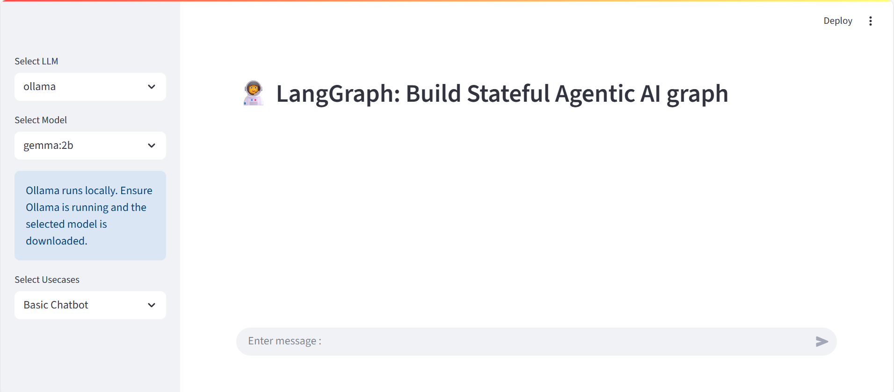
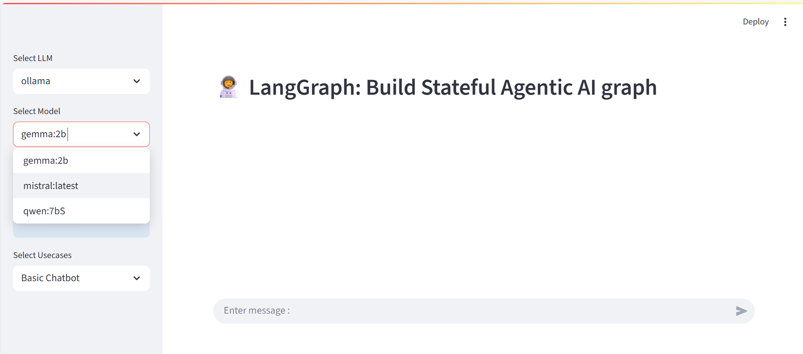
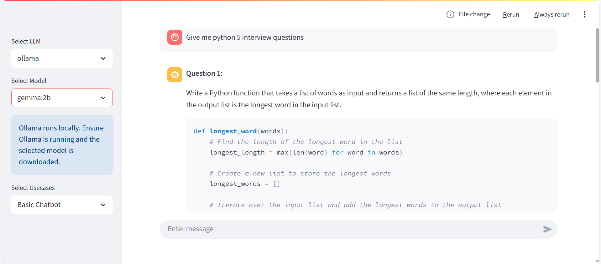

### 🧑‍🚀 LangGraph Agentic AI Chatbot

A Streamlit-based chatbot application that leverages LangGraph, LangChain, and Ollama to build modular, stateful conversational AI agents running on local LLMs.


### 📦 Table of Contents

- [Features](#features)
- [Screenshots](#screenshots)
- [Installation](#installation)
- [Usage](#usage)
- [Configuration](#configuration)
- [Project Structure](#project-structure)
- [Contact](#contact)


### 🚀Features
 
- Modular code structure under src/

- UI configuration via uiconfig.ini

- Select from multiple local LLM models (Gemma, Mistral, Qwen)

- Stateful multi-turn chat with session persistence

- Error handling for robust user experience

- Easily extensible for new usecases and nodes

### Screenshots

### Home Page


### Model Selection


### Chatbot Functionality



### 📥Installation

```bash
- git clone https://github.com/ShashankGowni/langgraph-agentic-chatbot.git
- cd langgraph-agentic-chatbot
- python -m venv venv
- source venv/bin/activate    # On Windows: venv\Scripts\activate
- pip install -r requirements.txt
```
Ensure Ollama is running locally and required models are downloaded.

### 💡Usage

```bash
streamlit run app.py
```

- Choose your preferred LLM and use case from the sidebar.

- Start chatting with your AI agent!

### ⚙️Configuration

**Edit src/lang_graph_chatbot/ui/uiconfig.ini to:**

- Change/add models and usecases
- Update page title and UI texts

### 🗂️Project Structure

```bash
app.py                       # Main Streamlit entrypoint
src/
  lang_graph_chatbot/
    LLMS/
    graph/
    nodes/
    state/
    ui/
      uiconfigfile.ini
      uiconfigfile.py
      loadui.py
      display_result.py
requirements.txt             # Dependencies
README.md                    # This file
.gitignore                   # Git ignores venv etc
venv/   
images                       # Screen Shots 
```
### 📧Contact

**Maintainer:** Shashank Gowni

📧 **Email:** [shashankgowni09@gmail.com](mailto:shashankgowni09@gmail.com)  
💼 **LinkedIn:** [www.linkedin.com/in/shashankgowni](https://www.linkedin.com/in/shashankgowni)  
📳 **Phone:** +91 9949701247